# Basic_Linux_Commands

## INTRODUCTION

A Linux command is a tool or program that operates through the command-line interface (CLI)—a text-based environment where you communicate with the system by typing commands.

To run a command, you simply type it into the Terminal and press Enter. These commands let you carry out many tasks such as installing software, managing users, handling files and folders, adjusting system settings, and more.

The basic structure of a Linux command is:
command_name [options] [arguments]

## Some basic Linux commands are:

1. ### sudo command:
The sudo (short for "superuser do") command allows a permitted user to run a command with the security privileges of another user, typically the root (administrator) user. It is essential for performing administrative tasks on a Linux system.

Using sudo ensures that only authorized users can make critical changes to the system. It's safer than logging in as the root user because it limits the scope of elevated access to just the commands you need.

In the screenshot below, I tried creating a folder in the root directory using only the mkdir command, I got a permission denied error message.

Whereas when I used the sudo command, I was able to create the folder successfully.

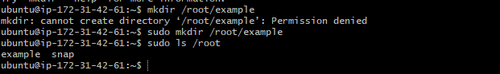

2. ### pwd command:
The pwd command stands for "print working directory." It is used to display the full path of the current directory you are in while working in the terminal.

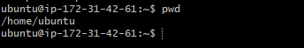

From the screenshot above, it can be seen that my current path when I ran the pwd command is /home/ubuntu.

3. ### cd command:
The cd command stands for "change directory" and is used to navigate between folders in the Linux file system from the command line.

As can been seen from the screenshot below, I used the cd / command to navigate to the root directory.
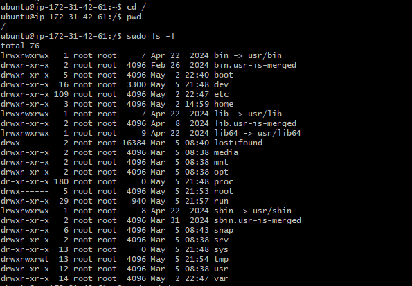

I also executed the following tasks:

1. Navigated into the /usr directory
1. Created a folder named 'Photos'
1. Navigated into the Photos directory
1. Created 3 more directories namely: 'Old', 'New', 'Modified'
1. Displayed the newly created directories using the ls command.
1. Navigated into the 'Old' directory using the command sudo ls /usr/Photos/Old
1. Using the pwd command, I displayed my path '/usr/photos/Old

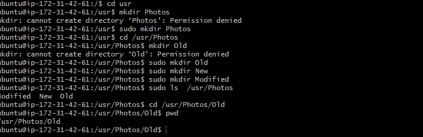

4. ### ls command:
The ls command is used to list the contents of a directory in Linux. It's one of the most basic and commonly used commands for navigating the filesystem.

As in the screenshot below, I ran the ls command to list the content of the home directory.

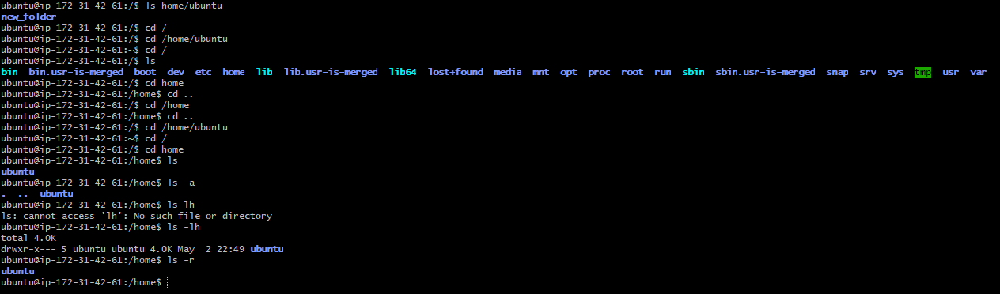

ls command can also be used with some options like:

ls -R lists all the files in the subdirectories.
ls -a shows hidden files in addition to the visible ones.
ls -lh shows the file sizes in easily readable formats, such as MB, GB, and TB.

5.  ### touch command:
The touch command is used to create empty files or update the timestamp of existing files without modifying their content.

In the screenshot below, I used the touch commnd to create a file named 'new_file'

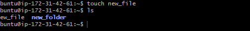

6. ### cat command:
The cat (short for concatenate) command is used to display the contents of files, combine multiple files, or create new files directly from the terminal.

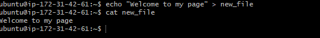

In the screenshot above, I used the cat command to display the contents of the file, new_file.

7. ### cp command:
The cp command is used to copy files and directories from one location to another in the Linux file system. The syntax is 'cp [options] source destination'

In the screenshot below, I copied the file, 'new_file' to the directory /home/ubuntu/new_folder using the cp command.

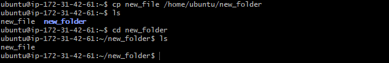

8. ### mv command:
The mv (move) command is used to move or rename files and directories in the Linux file system.

In the screenshot below, I ran the following command: mv /home/ubuntu/new_folder /home/ubuntu/second_folder to move the 'new_folder' directory to 'second_folder'

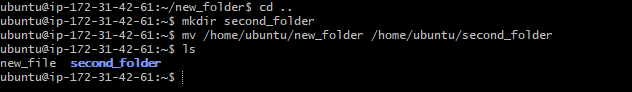

9. ### rm command:
The rm (remove) command is used to delete files and directories from the file system. The syntax is:
rm [options] file_or_directory

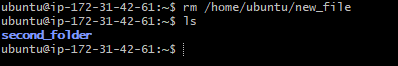

In the screenshot above, I used the rm command to delete the file 'new_file' from the ubuntu directory.

10. ### find command:
The find command is used to search for files and directories in a directory hierarchy. The basic syntax is:
find [path] [options] [expression]

In the screenshot below, I used the find command to search for the file, 'new_file' in the 'new_folder' directory.

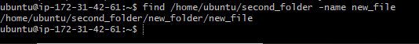